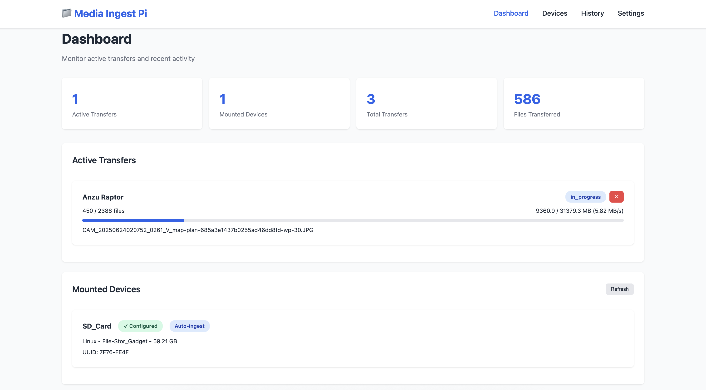
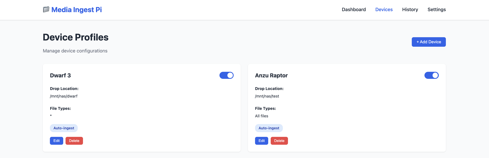
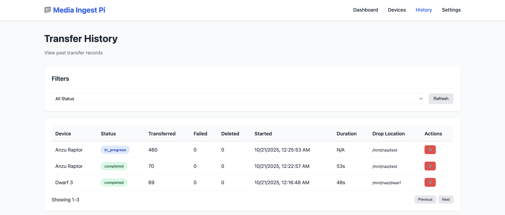

# Media Ingest Pi

A Raspberry Pi service that automatically detects USB drives, SD cards, and other removable media, and copies files to configured network locations. Features a web interface for management and MQTT integration with Home Assistant.

## Screenshots

### Dashboard


### Device Management


### Transfer History


## Quick Start

**One-line installation:**
```bash
curl -sSL https://raw.githubusercontent.com/bscholer/media-ingest-pi/main/install.sh | bash
```

Then access the web interface at `http://<raspberry-pi-ip>`

## Features

- 🔌 **Auto-detection**: Automatically detect USB drives/SD cards when plugged in
- 📁 **Device Profiles**: Configure per-device settings (drop location, file types, naming patterns)
- 🎯 **Multi-Destination Support**: Configure multiple transfer rules per device - send photos to one location, videos to another, panoramas to a third, all from the same SD card!
- 🔍 **Advanced Filtering**: Filter files by extension, source path patterns, or filename patterns
- 🌐 **Web Interface**: Modern web UI for management and monitoring with tabbed device configuration
- 📊 **Real-time Progress**: Track transfers with live progress updates
- 💡 **LED Progress Indicator**: Visual progress display on WS2812B LED strip
- 🏠 **Home Assistant Integration**: MQTT notifications and discovery
- 🔄 **Smart Naming**: Template-based file naming with multiple variables
- ✅ **Checksum Verification**: Ensure file integrity with optional checksums
- 🗑️ **Optional Deletion**: Automatically delete source files after successful transfer

## Installation

### Quick Install (Recommended)

One-liner installer that sets everything up automatically:

```bash
curl -sSL https://raw.githubusercontent.com/bscholer/media-ingest-pi/main/install.sh | bash
```

Or if you prefer to review the script first:
```bash
curl -sSL https://raw.githubusercontent.com/bscholer/media-ingest-pi/main/install.sh -o install.sh
chmod +x install.sh
./install.sh
```

After installation, configure everything through the web interface - no manual config file editing needed!

### Manual Installation

#### Requirements

- Raspberry Pi (any model with USB ports)
- Python 3.9 or higher
- Network storage location (NAS, SMB share, etc.)
- Optional: MQTT broker (e.g., Mosquitto, Home Assistant)

#### Setup

1. Clone the repository:
```bash
git clone https://github.com/bscholer/media-ingest-pi.git
cd media-ingest-pi
```

2. Install Python dependencies:
```bash
pip3 install -r requirements.txt --user
```

3. Create directories:
```bash
mkdir -p config data
```

4. Run the service (port 80 requires sudo):
```bash
sudo python3 src/main.py
```

5. Access the web interface and complete setup:
```
http://<raspberry-pi-ip>
```

Configuration files will be created automatically on first run. Configure your settings and devices through the web UI!

### Run as System Service

To run automatically on boot:

```bash
sudo cp media-ingest.service /etc/systemd/system/
sudo systemctl daemon-reload
sudo systemctl enable media-ingest
sudo systemctl start media-ingest
```

**Note about Port 80**: The default configuration uses port 80 (standard HTTP port), which is a privileged port on Linux. The systemd service is configured to allow binding to port 80 without running as root using `CAP_NET_BIND_SERVICE` capability. If you run manually, you'll need to use `sudo python3 src/main.py` or change the port to a non-privileged port (1024+) in `config/settings.yaml`.

## Configuration

**All configuration is done through the web interface!** Visit the Settings and Devices pages to configure the service.

### Device Profiles

Create device profiles through the web UI. Each profile can include:

- **Name**: Friendly name for the device
- **Identifiers**: UUID, label, or vendor to match devices
- **Auto-ingest**: Automatically start transfer when device is detected
- **Transfer Rules**: Multiple rules per device, each with:
  - **Name**: Descriptive name for the rule (e.g., "RAW Photos", "Videos")
  - **Drop location**: Where to save files (local path or network share)
  - **File types**: Filter by extensions (e.g., `.jpg`, `.raw`, `.mp4`)
  - **Source path patterns**: Filter by directory structure (e.g., `**/DCIM/**`, `**/PANO/**`)
  - **Filename patterns**: Filter by filename (e.g., `IMG_*`, `*_PANO_*`)
  - **Naming pattern**: Template for renaming files (see below)
  - **Preserve structure**: Keep folder hierarchy or flatten to one directory
  - **Delete after**: Remove files from source after successful transfer
- **Enabled**: Enable/disable the profile

**Example:** A camera SD card can have three rules:
1. RAW photos (`.dng`, `.cr2`) → `/mnt/nas/photos/raw`
2. JPEG photos (`.jpg`) → `/mnt/nas/photos/jpeg`
3. Videos (`.mp4`) → `/mnt/nas/videos`

### Global Settings

Configure these in the Settings page:

- **MQTT**: Enable Home Assistant integration with broker details
- **Default drop location**: Fallback location for unmatched devices
- **Temp directory**: Temporary storage during transfers
- **Checksum verification**: Verify file integrity after transfer
- **Concurrent transfers**: Number of parallel file copies
- **LED Strip**: Configure WS2812B LED strip for visual progress indication

### LED Strip Progress Indicator

Display transfer progress on an addressable WS2812B LED strip! Configure through the Settings page:

- **Enable/Disable**: Toggle LED strip functionality
- **GPIO Pin**: Pin number in BCM mode (default: GPIO 18, physical pin 12)
- **LED Count**: Number of LEDs in your strip
- **Brightness**: Adjust brightness (0-255)
- **Colors**: Customize colors for idle, progress, success, and error states

**Animations:**
- 🌊 **Idle**: Breathing blue animation when no transfers are active
- 📊 **Progress**: Green fill bar showing transfer completion percentage
- ✅ **Success**: Pulsing green animation on successful completion
- ❌ **Error**: Flashing red animation on transfer errors

**Hardware Requirements:**
- WS2812B/NeoPixel LED strip (or compatible: WS2811, SK6812)
- Power supply suitable for your LED count (5V, ~60mA per LED at full brightness)
- Connect LED data line to GPIO 18 (or your chosen pin)
- Common ground connection between Pi and LED power supply

**Note**: The LED strip requires PWM and will need to run with elevated privileges. The service handles this automatically when run via systemd.

### Advanced: Manual Configuration

While the web UI is recommended, you can also edit YAML files directly in the `config/` directory if needed. See `config/settings.example.yaml` and `config/devices.example.yaml` for structure reference.

### Naming Pattern Variables

Use these variables in naming patterns:

- `{date}`: YYYY-MM-DD
- `{datetime}`: YYYY-MM-DD_HH-MM-SS
- `{device}`: Device name (sanitized)
- `{counter}` or `{counter:04d}`: Sequential number with padding
- `{original}`: Original filename without extension
- `{ext}`: File extension
- `{year}`, `{month}`, `{day}`: Individual date components
- `{uuid}`: Random UUID

Example: `{date}_{device}_{counter:04d}{ext}` → `2025-10-19_Camera-SD-Card_0001.jpg`

## Web Interface

- **Dashboard** (`/`): Active transfers, recent activity, device status
- **Devices** (`/devices`): Manage device profiles
- **Settings** (`/settings`): Configure MQTT and global settings
- **History** (`/history`): View transfer history

## MQTT Integration

When MQTT is enabled, the service publishes events to Home Assistant:

- Device detected
- Transfer started/progress/completed/failed
- Home Assistant auto-discovery

## License

MIT License - See LICENSE file for details

## Contributing

Contributions welcome! Please open an issue or pull request. See [CONTRIBUTING]()

